# TiltedTrades Site Map & Architecture Diagram

**Generated:** November 29, 2025

---

## 1. Application Route Map

```mermaid
flowchart TB
    subgraph PUBLIC["🌐 Public Routes"]
        LANDING["/landing<br/>Landing Page"]
        LOGIN["/login<br/>LoginForm"]
        SIGNUP["/signup<br/>SignupForm"]
        CONFIRM["/confirm-signup<br/>ConfirmSignUp"]
        FORGOT["/forgot-password<br/>ForgotPassword"]
        RESET["/reset-password<br/>ResetPassword"]
    end

    subgraph PROTECTED["🔒 Protected Routes (/app/*)"]
        DASHBOARD["/app<br/>DashboardNew"]
        TRADES["/app/trades<br/>TradeLog"]
        BALANCE["/app/balance<br/>Balance"]
        ANALYTICS["/app/analytics<br/>AnalyticsAPI"]
        CALENDAR["/app/calendar<br/>CalendarNew"]
        JOURNALS["/app/journals<br/>JournalList"]
        JOURNALEDIT["/app/trades/:tradeId/journal<br/>JournalEditor"]
        TRADEDETAIL["/app/journal/:tradeId<br/>TradeDetail"]
        SETTINGS["/app/settings<br/>Settings"]
    end

    subgraph DISABLED["⏸️ Disabled Routes"]
        LEADERBOARD["/app/leaderboard<br/>Leaderboard"]
        PROFILE["/app/profile/:userId<br/>PublicProfile"]
    end

    ROOT["/"] --> |Auth Check| AUTHCHECK{Authenticated?}
    AUTHCHECK -->|Yes| DASHBOARD
    AUTHCHECK -->|No| LANDING
    
    LANDING --> LOGIN
    LANDING --> SIGNUP
    LOGIN --> DASHBOARD
    SIGNUP --> CONFIRM
    CONFIRM --> DASHBOARD
    LOGIN --> FORGOT
    FORGOT --> RESET
    RESET --> LOGIN

    DASHBOARD --> TRADES
    DASHBOARD --> BALANCE
    DASHBOARD --> ANALYTICS
    DASHBOARD --> CALENDAR
    DASHBOARD --> JOURNALS
    TRADES --> JOURNALEDIT
    TRADES --> TRADEDETAIL
    JOURNALS --> TRADEDETAIL

    style PUBLIC fill:#e8f5e9
    style PROTECTED fill:#e3f2fd
    style DISABLED fill:#fafafa,stroke-dasharray: 5 5
```

---

## 2. Component Hierarchy

---

## 3. Frontend → API Gateway → Lambda Flow

---

## 4. Data Upload & Processing Pipeline

---

## 5. Authentication Flow

---

## 6. Trade Matching Engine Logic

---

## 7. Nightly Stats Calculation

```mermaid
flowchart LR
    subgraph TRIGGER["⏰ EventBridge"]
        EB[Scheduled Rule<br/>2 AM UTC Daily]
    end

    subgraph LAMBDA["⚡ stats-calculator"]
        L1[Scan All Users]
        L2[For Each User:]
        L3[Get Preferences]
        L4[Query MatchedTrades]
        L5[Calculate Metrics]
        L6[Update TradingStats]
        L7[Update UserProfile<br/>Summary Stats]
    end

    subgraph DYNAMO["🗄️ DynamoDB"]
        D1[UserProfiles]
        D2[UserPreferences]
        D3[MatchedTrades]
        D4[TradingStats]
    end

    EB --> L1
    L1 --> D1
    D1 --> L2
    L2 --> L3 --> D2
    D2 --> L4 --> D3
    D3 --> L5 --> L6 --> D4
    L6 --> L7 --> D1

    style TRIGGER fill:#fff9c4
    style LAMBDA fill:#e8f5e9
    style DYNAMO fill:#fce4ec
```

---

## 8. Complete API Endpoint Reference

---

## 9. State Management Flow

---

## 10. Lambda Function Dependencies

```mermaid
flowchart TB
    subgraph LAYER["📚 @tiltedtrades/calculations Layer"]
        L1[TradeMatchingEngine]
        L2[StatisticsCalculator]
        L3[CommissionCalculator]
        L4[ContractSpecsCalculator]
        L5[data/commissions.json]
        L6[data/tick-values.json]
    end

    subgraph LAMBDAS["⚡ Lambda Functions"]
        F1[trades-data<br/>Python 3.11]
        F2[trading-data-processor<br/>Node.js 20.x]
        F3[stats-calculator<br/>Node.js 20.x]
        F4[file-upload-handler<br/>Node.js 20.x]
        F5[user-profile-api<br/>Node.js 20.x]
        F6[trade-journal-api<br/>Node.js 20.x]
        F7[public-profiles-api<br/>Node.js 20.x]
        F8[post-registration-trigger<br/>Node.js 20.x]
    end

    F2 --> LAYER
    F3 --> LAYER
    
    F1 -->|Async Invoke| F2
    F2 -->|Updates| D1[(MatchedTrades)]
    F3 -->|EventBridge| D2[(TradingStats)]

    F4 -->|Generates| S3[(S3 Presigned URL)]
    S3 -->|Triggers| F1

    F8 -->|Cognito Post-Confirm| D3[(UserProfiles)]

    style LAYER fill:#fff9c4
    style LAMBDAS fill:#e8f5e9
```

---

*Diagrams generated using Mermaid syntax*
