# TiltedTrades Site Map & Architecture Diagrams

**Last Updated:** November 29, 2025

---

## 1. Application Routes Overview

---

## 2. Complete Page → Component → API Flow

```mermaid
flowchart LR
    subgraph Pages["📄 Pages"]
        P1[DashboardNew]
        P2[TradeLog]
        P3[Balance]
        P4[JournalList]
        P5[JournalEditor]
        P6[TradeDetail]
        P7[AnalyticsAPI]
        P8[CalendarNew]
        P9[Settings]
    end
    
    subgraph Hooks["🪝 React Query Hooks"]
        H1[useTrades]
        H2[useStats]
        H3[useBalance]
        H4[useJournal]
        H5[useSettings]
        H6[useProfile]
        H7[useUpload]
    end
    
    subgraph Services["⚙️ API Services"]
        S1[tradeService]
        S2[balanceService]
        S3[journalService]
        S4[userService]
        S5[uploadService]
        S6[authService]
    end
    
    P1 --> H1 & H2
    P2 --> H1
    P3 --> H3
    P4 --> H4
    P5 --> H4 & H1
    P6 --> H1 & H4
    P7 --> H1 & H2
    P8 --> H1
    P9 --> H5 & H6
    
    H1 --> S1
    H2 --> S1
    H3 --> S2
    H4 --> S3
    H5 --> S4
    H6 --> S4
    H7 --> S5
```

---

## 3. API Gateway Endpoints Map

---

## 4. Lambda Functions & Triggers

---

## 5. Data Processing Pipeline

---

## 6. DynamoDB Tables & Access Patterns

---

## 7. Authentication Flow

---

## 8. Component Hierarchy

---

## 9. State Flow Diagram

---

## 10. File Upload Sequence

---

## Quick Reference: API Endpoints Summary

| Endpoint | Method | Lambda | Purpose |
|----------|--------|--------|---------|
| `/api/users/{userId}/executions` | GET | user-profile-api | List raw executions |
| `/api/users/{userId}/trades` | GET | user-profile-api | List matched trades |
| `/api/users/{userId}/stats` | GET | user-profile-api | Get trading statistics |
| `/api/users/{userId}/balance` | GET/POST | user-profile-api | Balance entries CRUD |
| `/api/users/{userId}/balance/{id}` | PUT/DELETE | user-profile-api | Update/delete entry |
| `/api/users/{userId}/balance/templates` | GET/POST | user-profile-api | Recurring templates |
| `/api/users/{userId}/profile` | GET/PUT | user-profile-api | User profile |
| `/api/users/{userId}/preferences` | GET/PUT | user-profile-api | User preferences |
| `/api/users/{userId}/upload` | POST | file-upload-handler | Get presigned URL |
| `/api/users/{userId}/journals` | GET | trade-journal-api | List all journals |
| `/api/users/{userId}/trades/{id}/journal` | GET/POST/DELETE | trade-journal-api | Journal CRUD |
| `/api/users/{userId}/trades/{id}/journal/charts` | POST | trade-journal-api | Upload chart |
| `/api/users/{userId}/trades/{id}/journal/charts/{cid}` | DELETE | trade-journal-api | Delete chart |
| `/api/public/profiles` | GET | public-profiles-api | Leaderboard |
| `/api/public/profiles/{userId}` | GET | public-profiles-api | Public profile |

---

*Generated by Claude Code analysis*
